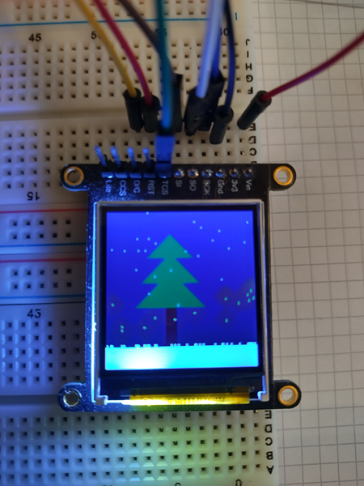

# Stm32SpiLcdChristmasTree
This project draws a simplified christmas tree to LCD.

## Hardware prerequisites
- STM32 Nucleo F072RB board
- LCD St7735
- Hardware wiring see https://github.com/JohnBell23/LcdOnStm32ViaSpi

## Get started
- Open the project in CubeIDE compile and download via ST-Link

